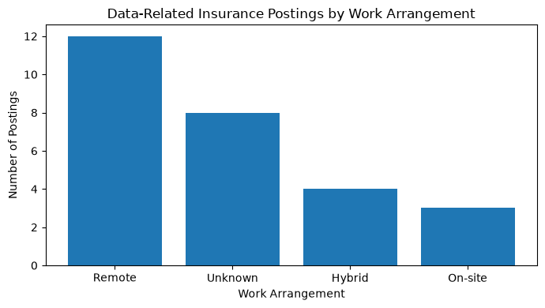
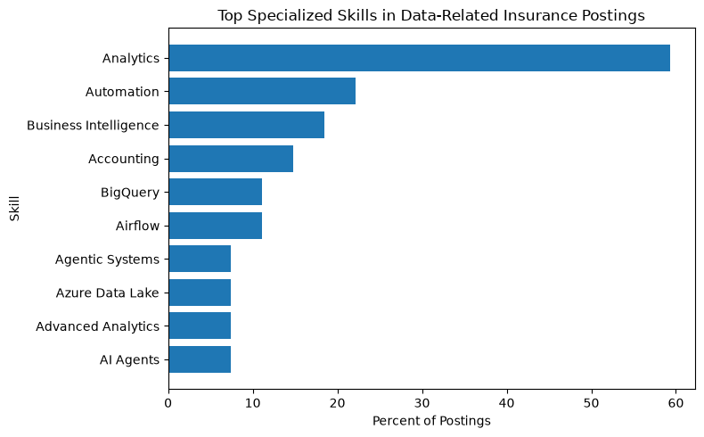

# Market Baseline

This market baseline examines data-related job postings within the Insurance Carrier industry (NAICS 5241). The analysis focuses on job volume, salary, location, experience requirements, work arrangement, hiring patterns, and specialized skills.

The team identified **27 data-related postings** from the Insurance Carrier dataset after applying the project role filter.

## Load the Cleaned Dataset

```{python}
import pandas as pd
from pathlib import Path

# Find the project root
project_root = Path.cwd()

while not (project_root / "_quarto.yml").exists():
    if project_root.parent == project_root:
        raise FileNotFoundError("Could not find project root.")
    project_root = project_root.parent

# Load the cleaned dataset
data_path = (
    project_root
    / "processed"
    / "insurance_5241_data_roles_cleaned.csv"
)

df = pd.read_csv(data_path)

print("Total data-related postings:", len(df))
```

## Job Volume by Title

```{python}
top_titles = (
    df["TITLE_CLEAN"]
    .value_counts()
    .head(10)
)

top_titles
```

The cleaned dataset contains **27 data-related postings** across several related data roles. These include Data Engineer, Data Analyst, Data Scientist, Business Intelligence, and other technical data positions.

## Salary Distribution

```{python}
salary_df = df[
    df["ANNUAL_SALARY_MIDPOINT"].notna()
]

print("Postings with salary:", len(salary_df))
print(
    "Average annual salary midpoint:",
    round(salary_df["ANNUAL_SALARY_MIDPOINT"].mean(), 2)
)
print(
    "Minimum salary midpoint:",
    round(salary_df["ANNUAL_SALARY_MIDPOINT"].min(), 2)
)
print(
    "Maximum salary midpoint:",
    round(salary_df["ANNUAL_SALARY_MIDPOINT"].max(), 2)
)
```

Salary information was available for only **5 of the 27 postings**. Among those postings, the average annual salary midpoint was approximately **$163,840**.

The salary midpoint ranged from approximately **$93,000 to $280,000**. Because salary information was missing for most postings, these results should be interpreted cautiously.

## Location Patterns

```{python}
state_counts = (
    df["CLEAN_STATE"]
    .dropna()
    .value_counts()
)

state_counts
```

Valid state information was available for only **9 of the 27 postings**. Because geographic information was missing or inconsistent for many postings, state-level demand patterns should be interpreted cautiously.

## Experience Requirements

The structured `MIN_YEARS_EXPERIENCE` and `MAX_YEARS_EXPERIENCE` fields did not contain usable experience information for any of the 27 filtered postings.

Because structured experience information was unavailable, an experience-requirement distribution could not be calculated. Missing experience values were retained as missing rather than estimated.

## Remote vs. On-Site Work



The filtered postings included:

- **12 remote**
- **4 hybrid**
- **3 on-site**
- **8 unknown**

Remote work was the most common identifiable work arrangement among the data-related Insurance Carrier postings.

## Top Employers

```{python}
top_employers = (
    df["COMPANY_NAME"]
    .dropna()
    .value_counts()
    .head(10)
)

top_employers
```

The employer counts show which organizations contributed the most data-related postings within the filtered Insurance Carrier sample.

## Top Specialized Skills



Skills information was more complete than salary, experience, and geographic information.

The strongest specialized-skill signals were:

- **Analytics — 59.3%**
- **Automation — 22.2%**
- **Business Intelligence — 18.5%**
- **Accounting — 14.8%**
- **Airflow — 11.1%**
- **BigQuery — 11.1%**

Analytics was the most frequently identified specialized skill among the data-related postings.

## Key Findings and Limitations

The Insurance Carrier sample contained **27 data-related postings**. Remote work was the most common identifiable work arrangement.

Salary information was available for only **5 postings**, with an average annual salary midpoint of approximately **$163,840**. Because the salary sample is small, this value should not be interpreted as representative of the entire Insurance Carrier data-job market.

Structured experience information was unavailable for all 27 postings, while valid state information was available for only a subset of the sample.

Skills information was considerably more complete. Analytics, Automation, Business Intelligence, Airflow, and BigQuery were among the most frequently identified specialized skills.

These missing-data limitations should be considered when interpreting the market baseline results.